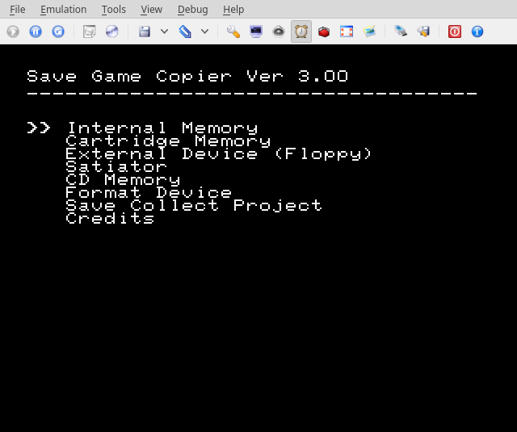
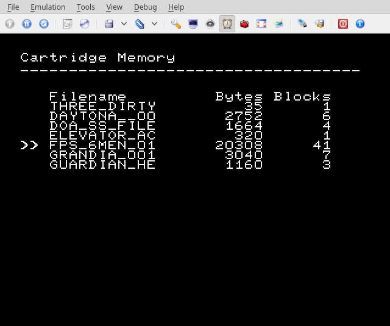
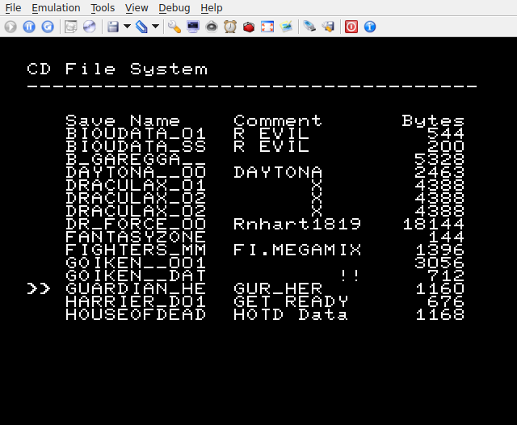
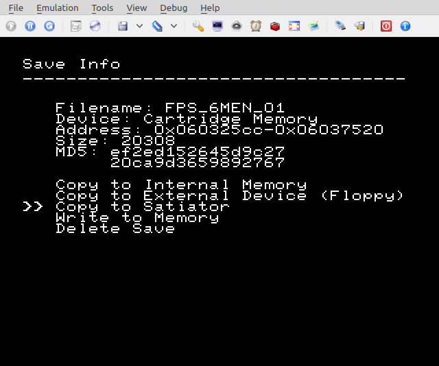
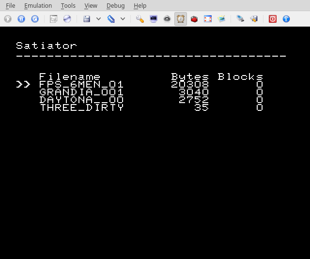
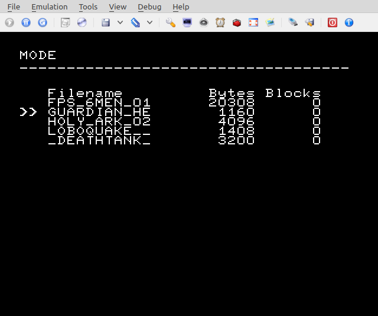
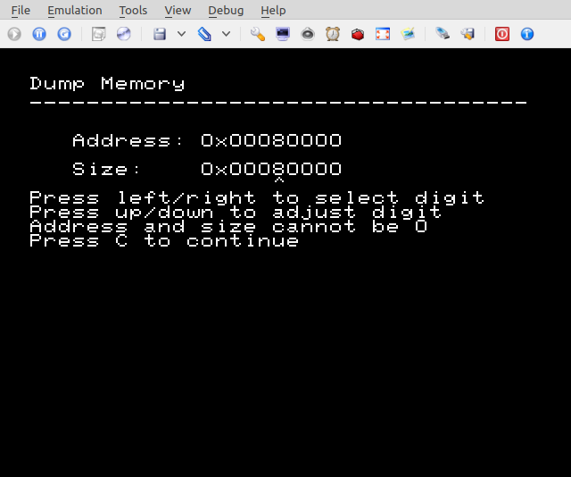

# Save Game Copier (SGC)
Copy Sega Saturn save game files to and/or from internal memory, cartridge memory, external devices (e.g. Sega Saturn [Floppy Disk Drive](https://segaretro.org/Saturn_Floppy_Drive)), Satiator ODE, MODE, and CD. Build with [Jo Engine](https://github.com/johannes-fetz/joengine) or download an ISO from [releases](https://github.com/slinga-homebrew/Save-Game-Copier/releases). One of the most useful features of SGC is to create a custom SGC ISO with your own save game files and copy them to your Saturn.

SGC is for copying save games to a Saturn. To copy save games from Saturn -> PC use [Save Game Extractor](https://github.com/slinga-homebrew/Save-Game-Extractor).

## Screenshots








## Save Games Format (.BUP)
SGC uses saves in the .BUP save format. The .BUP format consists of the metadata along with the raw save itself. The format is documented in [Save Game BUP Scripts](https://github.com/slinga-homebrew/Save-Game-BUP-Scripts) along with a script to convert between .BUP and raw saves. 

* All files on a CD are limited to 8 character names plus 3 characters for the .BUP extension.
* The .BUP extension is required. 

* If you want your ISO to work properly on a Saturn you have to rename the file to an 8.3 character file. For example if the file you are adding is FPS_6MEN_01.BUP, rename to FPS_6MEN.BUP.

Additional examples:
GRANDIA_001.BUP -> GRANDIA_.BUP
THREE_DIRTY.BUP -> THREE_DI.BUP

MODE and Satiator can use longer 14.3 filenames. 

## Adding Custom Save Games to the SGC ISO
There are two ways to add your custom save game files to SGC:
1) (Windows) Using something like WinISO add your save game file to the SATSAVES directory. Again read the instructions in "Save Game Format" so you have the correct type of file and filename. The filename must be in the 8.3 format.
1) (Linux)
```
# mount the original
mkdir /tmp/sgc_custom
sudo mount -t iso9660 -o loop sgc_original.iso /mnt/
cd /mnt/
tar cf - . | (cd /tmp/sgc_custom; tar xfp -)

# make the necessary changes
# remember that filenames must be in 8.3 format
cd /tmp/sgc_custom/SATSAVES
<add\delete saves as needed>

# convert your changes back into an iso
mkisofs -o sgc_modified.iso /tmp/sgc_custom

# insert the boot headers from the original iso into the modified
dd conv=notrunc if=sgc_original.iso of=sgc_modified.iso bs=1 count=32768
```

2) If you are comfortable compiling SGC, you can also add saves at build time. Checkout SGC from source. Add your save game files (in a raw format) to cd/SATSAVES/ and recompile. Again read the instructions in "Save Game Format" so you have the correct type of file and filename.  The newly built ISO will include your saves.

## Satiator Support
I don't own a Satiator so my testing has solely been with the [Satiator Yabause fork](https://github.com/satiator/satiator-yabause). When using a Satiator:
* Make sure you upgrade to the latest firmware. There have been firmware fixes
* Create a "SATSAVES" directory on the root of the drive. SGC is hardcoded to use that folder. Copy saves to and from that folder.
* Saves must use the .BUP file extensions or they will not be visible. Filenames can be 11 characters + 3 more for the extension. 

## MODE Support
* Ensure you are running firmware >= 1.04
* Create a "SATSAVES" directory on the root of the SD card. SGC is hardcoded to use that folder and the SD card HDD is not supported yet. 
* Saves must use the .BUP file extensions or they will not be visible. Filenames can be 11 characters + 3 more for the extension. 
* You must use the cue file named *game_cue_for_mode.cue* **INSTEAD OF** *game.cue* file. Ensure only 1 cue is present along with game.iso file. This is required because MODE needs a large TOC for the command interface.

## Dumping Memory
SGC also supports advanced feature to arbitrary dump memory. This can allow you to dump:
* Saturn BIOS (address: 0x80000, size: 0x80000)
* Internal backup memory (address: 0x00180000, size: 0x001FFFFF)
* Cartridge backup memory (address: 0x02000000, size: 0x01FFFFFF)
* etc

## Issues
* Non-English save game comments are not displayed. This is a limitation of the print routine I'm using. However the comments are copied correctly and can be viewed within the Saturn BIOS. I'm researching a workaround.  
* Once you access the Satiator you can no longer list the saves in the "CD Memory" option. I don't know if this is an issue with Satiator or the Satiator-Yabause fork I am testing with. If you really want to transfer multiple "CD Memory" saves to your Satiator, transfer them to your Internal Memory first. From there you can transfer multiple saves to the Satiator without issue. Or since you have a Satiator you can just put the saves on your SD card...
* Some Satiator users have reported the first transfer takes ~90 seconds and then all other transfers are fast. Professor Abrasive is aware of the issue. It's possible the issue is related to the SD card itself. Try running a chkdsk.

## Troubleshooting
When debugging saves that don't work, load SGC on both systems and verify the MD5 hash and file size of both saves. The most likely issue is that of metadata being included. The other common issue is the name of the file.

SGC uses a dynamic menu and will remove devices it doesn't detect from your menu. If SGC is having trouble seeing your backup cartridge make sure the builtin Saturn memory manager can see the cartridge. Most likely the Saturn can't see the cartridge and therefore neither can SGC.

MODE is not detected. Make sure you use the game_cure_for_mode.cue otherwise the MODE will not be detected.

## Saturn Save Games Collect Project
Want to share your save games on the web? Send them to the [Save Games Collect](https://ppcenter.webou.net/pskai/savedata/) project. Made by Cafe-Alpha, the author of the Gamer's Cartridge. Please submit your ".BUP" files. 

## License
Licensed under GPL3 to comply with the Iapetus license.

## 3rd Party Code
Save Game Copier uses code from:
* [Jo Engine](https://github.com/johannes-fetz/joengine) - MIT
* [MD5](http://openwall.info/wiki/people/solar/software/public-domain-source-code/md5) - BSD
* [satiator-menu](https://github.com/satiator/satiator-menu) - MPL and GPL
* [iapetus](https://github.com/cyberwarriorx/iapetus) - GPL

## Credits
* Thank you to [Johannes Fetz](https://github.com/Johannes-Fetz) for [Jo Engine](https://github.com/johannes-fetz/joengine) and adding features needed by Save Game Copier.  
* Thank you to [Emerald Nova](https://github.com/EmeraldNova) for volunteering to test the code on his Satiator.
* Thank you to [Terraonion](https://github.com/Terraonion-dev) for contributing MODE support.
* Thank you to [RevQuixo](https://github.com/RevQuixo) for numerous bug reports. 
* Special thanks to Antime, Ponut, VBT, and everyone else at SegaXtreme keeping the Saturn dev scene alive.
* Thank you to Takashi for the original Save Game Copier idea back in ~2002.
* [Shentokk](https://github.com/Shentokk) for information regarding emulator save game extraction
